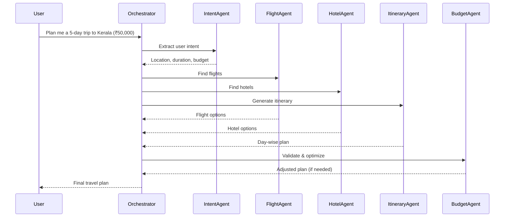

# Multi-Agent Travel Planner  

A multi-agent orchestration project where AI agents collaborate to plan a personalized trip. The system extracts user intent, finds flights, hotels, and activities, optimizes the budget, and delivers a complete travel itinerary.  

---

## Features  
- **User Intent Understanding** – Extracts location, duration, budget, and preferences from natural language.  
- **Flight Agent** – Finds flight options from mock datasets or APIs.  
- **Hotel Agent** – Suggests hotels based on price, location, and reviews.  
- **Itinerary Agent** – Creates a day-wise travel plan.  
- **Budget Optimizer Agent** – Ensures the plan fits the user’s budget.  
- **Orchestrator Agent** – Coordinates all agents and finalizes the plan.  

---

## Tech Stack  

### Frontend  
- **React.js** → User interface (trip planner dashboard)  
- **Material UI (MUI)** → Responsive and modern design  

### Backend  
- **FastAPI** → API layer and agent orchestration  
- **SQLite** → Lightweight relational database for user queries & plans  
- **ChromaDB** → AI-native vector database for semantic search & agent memory  

### AI & Agents  
- **OpenAI Agent SDK** → Multi-agent orchestration framework  
- **OpenAI GPT-4.0** → Core reasoning and planning model  

---

## Project Structure  
```
multi-agent-travel-planner/
│── frontend/           # React + MUI UI
│── backend/            # FastAPI services & agent orchestration
│── db/                 # SQLite database schema
│── ai/                 # Agent definitions, ChromaDB integration
│── README.md           # Project documentation
```

---

## Orchestration Flow  



---

## Setup Instructions  

1. **Clone Repo**  
```bash
git clone https://github.com/your-username/multi-agent-travel-planner.git
cd multi-agent-travel-planner
```

2. **Backend Setup**  
```bash
cd backend
pip install -r requirements.txt
uvicorn main:app --reload
```

3. **Frontend Setup**  
```bash
cd frontend
npm install
npm run dev
```

4. **Database Setup**  
- SQLite will be auto-created on first run.  
- ChromaDB initializes with `ai/` configuration.  

---

## Future Enhancements  
- Weather Agent for travel date suggestions  
- Local Transport Agent (cabs, trains)  
- Real flight/hotel API integration  

---
